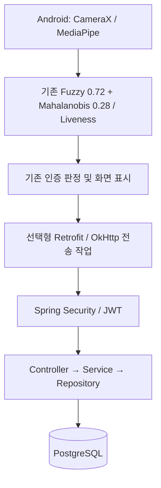

# AndFace Backend

기존 Android 얼굴 인증에 계정·기기·판정 이력·통계를 추가하는 독립 Java 서버입니다. 얼굴 분석과 최종 판정은 여전히 Android가 수행합니다. 서버는 클라이언트가 보고한 결과를 검증하고 저장합니다. 서버에 `SUCCESS`가 저장됐다는 사실만으로 위변조되지 않은 얼굴 인증을 독립적으로 증명하지는 않습니다.

## 1. Architecture



- Android Gradle 프로젝트와 Maven 서버는 따로 빌드합니다.
- 서버 연결을 설정하지 않으면 전송하지 않습니다. 서버 장애는 Android 인증 결과를 변경하지 않습니다.
- 이미지, 랜드마크, 특징 벡터, 등록 baseline은 DTO와 DB에 없습니다. 알 수 없는 JSON 필드는 400으로 거부합니다.
- 현재 실제 앱의 특징 구조는 **170개**입니다. 과거 문서의 13개로 되돌리지 않았습니다.

## 2. 사용 기술 및 구조

Java 21, Spring Boot 4.1.1, Maven, Spring MVC, JPA/Hibernate, Validation, PostgreSQL JDBC, Flyway, Spring Security Resource Server/Nimbus JWT, BCrypt, springdoc 3.1.1, Lombok을 사용합니다. Android는 Retrofit 3.0.0과 OkHttp 4.12.0을 사용합니다.

```text
src/main/java/com/andface/backend/
  config/           Security, OpenAPI
  security/         JWT 발급
  controller/       사용자·기기·인증·관리자 API
  service/          소유권·검증·저장·조회
  repository/       JPA 저장소
  entity/           UserAccount, Device, AuthenticationLog
  dto/request/      요청 record
  dto/response/     응답 record
  common/           공통 오류 응답
  exception/        예외 및 전역 처리
src/main/resources/db/migration/   DB 마이그레이션
src/test/java/com/andface/backend/ 단위·실제 PostgreSQL 통합 테스트
```

## 3. Database Schema

정확한 DDL은 `src/main/resources/db/migration/`에 있습니다. Flyway가 생성하고 Hibernate가 스키마 일치 여부를 검사합니다.

| 테이블 | 주요 필드 / 제약 |
|---|---|
| users | UUID id, unique user_code, unique username, BCrypt password_hash, USER/ADMIN role, created_at, updated_at |
| devices | UUID id, user_id FK, device_id, device_name, registered_at, last_access_at, active; 계정별 device_id 중복 금지 |
| authentication_logs | UUID id, user_id/device_id FK, event_id, SUCCESS/FAILED, fuzzy_score, mahalanobis_score, final_score, coverage, margin, liveness, failure_reason, occurred_at, created_at |

- 한 계정에 여러 기기를 등록할 수 있습니다. 기기 삭제는 비활성화이며 기존 이력은 보존합니다. 재등록하면 다시 활성화됩니다.
- 점수·coverage·margin은 유한한 0..1 값이며 DB CHECK 제약도 적용합니다.
- SUCCESS는 liveness=true 및 failureReason=null, FAILED는 failureReason 필수입니다. 서버가 점수를 다시 계산하거나 threshold를 바꾸지는 않습니다.
- `eventId`는 계정별 중복 금지입니다. 동일 이벤트 재전송은 기존 레코드를 반환하고 다른 내용으로 재사용하면 409입니다.
- `createdAt`은 서버 수신 시각, `occurredAt`은 클라이언트 관측 시각입니다. PostgreSQL 마이크로초 정밀도로 처리합니다.

## 4. 환경 변수

| 변수 | 내용 |
|---|---|
| DB_URL | 예: `jdbc:postgresql://localhost:5432/andface` |
| DB_USERNAME | DB 계정 |
| DB_PASSWORD | DB 비밀번호 |
| JWT_SECRET | 무작위 32바이트 이상을 Base64로 인코딩한 값 |
| PORT | 기본 8080 |

`.env.example`을 참고하세요. 실제 `.env`, `.local`, 빌드 산출물은 Git에서 제외합니다. 일반 `java -jar` 실행은 `.env`를 자동으로 읽지 않으므로 환경 변수를 셸에서 설정해야 합니다.

PowerShell에서 JWT용 값을 생성하는 예:

```powershell
$secretBytes = New-Object byte[] 32
[Security.Cryptography.RandomNumberGenerator]::Create().GetBytes($secretBytes)
$env:JWT_SECRET = [Convert]::ToBase64String($secretBytes)
```

JWT 유효기간은 900초입니다. 만료 시 다시 로그인합니다. 비밀번호 원문과 토큰은 로그로 출력하지 않습니다. 관리자 권한은 요청 JSON으로 지정할 수 없습니다.

## 5. 실행 방법

### Docker

```powershell
cd backend
Copy-Item .env.example .env
# .env의 DB_PASSWORD, JWT_SECRET을 실제 무작위 값으로 설정
docker compose up --build
```

Compose는 PostgreSQL 17과 서버를 실행합니다. DB는 외부 포트를 공개하지 않고, 서버는 PC의 `127.0.0.1:8080`에 연결합니다. 데이터는 Docker volume에 보존됩니다. 일반 모바일 서비스 배포 시 HTTPS reverse proxy를 앞에 설정해야 합니다.

### 설치된 PostgreSQL 사용

Java 21 및 Maven 3.9 이상을 준비하고, PostgreSQL에 DB와 계정을 만든 뒤:

```powershell
$env:DB_URL = 'jdbc:postgresql://localhost:5432/andface'
$env:DB_USERNAME = 'andface'
# DB_PASSWORD와 JWT_SECRET은 실제 값으로 환경에 설정
mvn clean package
java -jar target/andface-backend-1.0.0.jar
```

### Docker/DB 설치 없이 USB 시연하기

```powershell
# JAVA_HOME은 Java 21, Maven은 PATH에 설정
.\scripts\run-local-demo.ps1
```

시험용 `LocalDemoServer`가 embedded PostgreSQL 14.22와 서버를 실행합니다. 둘 다 PC loopback에만 바인딩합니다. 데이터와 임의 JWT 키는 `backend/.local/`에 보존됩니다. 이 DB는 로컬 trust 인증이므로 개발 시연 전용입니다. 운영 jar에는 시험 서버와 embedded DB가 포함되지 않습니다. 종료는 Ctrl+C입니다. 같은 포트(8080, 55432)의 서버를 중복 실행하지 마세요.

## 6. API 목록

| Method | URL | 권한 / 기능 |
|---|---|---|
| POST | /api/users/register | 공개, 계정 생성(201) |
| POST | /api/users/login | 공개, JWT 반환(200) |
| GET | /api/users/me | 로그인 계정 조회 |
| POST | /api/devices | 본인 기기 등록/재활성화(201) |
| GET | /api/devices | 본인 활성 기기 목록 |
| DELETE | /api/devices/{id} | 본인 기기 비활성화(204) |
| POST | /api/authentication/results | 본인 계정·활성 기기의 결과 저장(201) |
| GET | /api/authentication/history | 본인 이력, 필터·페이지네이션 |
| GET | /api/authentication/history/{id} | 본인 이력 상세 |
| GET | /api/authentication/statistics | 본인 기간별 집계 |
| GET | /api/admin/authentication/history | ADMIN, 모든 계정 또는 특정 userCode 이력 |
| GET | /api/admin/authentication/history/{id} | ADMIN, 이력 상세 |
| GET | /api/admin/authentication/statistics | ADMIN, 모든 계정 또는 특정 userCode 집계 |

보호 API 헤더: `Authorization: Bearer <accessToken>`. 일반 API는 ADMIN 계정도 본인 범위로 동작하며, 전체 조회는 관리자 URL을 사용합니다. 기기 등록은 계정에 대한 소유권 연결이며 하드웨어 attestation은 아닙니다.

회원가입 JSON: `{"userCode":"USER_1","username":"my_account","password":"<8~72바이트 비밀번호>"}`. 비밀번호는 UTF-8 72바이트 제한입니다. 일반 서버는 userCode를 계정마다 고유하게 사용합니다. 현재 앱 UI의 USER_1~3 슬롯은 서로 다른 휴대폰의 동일 인물임을 자동 보장하지 않으므로, 독립 사용자 집단을 위한 운영 계정/슬롯 매핑 확장은 별도 과제입니다.

이력 필터: `userCode`, `from=2026-09-01`, `to=2026-09-30`, `result=SUCCESS`, `page=0`, `size=20`(1..100). 날짜는 서버 수신 시각 UTC 기준이며 to 날짜를 포함합니다. 통계는 같은 날짜·사용자 필터를 사용하고 성공/실패를 함께 집계합니다. 성공률은 **0..1**이며 빈 데이터는 0을 반환합니다.

오류는 `{status, code, message, timestamp}` 형식입니다. 검증 오류 400, 로그인/JWT 오류 401, 권한 위반 403, 미등록 기기/없는 이력 404, 중복 사용자/이벤트 충돌 409를 사용합니다. 타인의 상세 이력 ID는 404로 처리합니다.

ADMIN은 운영자가 DB에서 신뢰할 수 있는 특정 계정의 `role`만 ADMIN으로 승격합니다. 공개 승격 API/기본 관리자 비밀번호는 없습니다. API에서 매 요청 DB의 현재 role을 확인합니다.

## 7. Android 연동 및 실제 변수 매핑

메인 화면 우측 상단 **버전 문구를 짧게 탭**하면 서버 설정을 엽니다. 기존 길게 누르기(상세 점수) 기능은 유지됩니다. 계정 가입 또는 로그인하면 기기를 등록합니다. 연결하지 않아도 기존 얼굴 인증이 작동합니다. 설정 화면만 계정 정보 보호를 위해 캡처를 제한하며, 기존 인증 성공 화면의 캡처 정책은 변경하지 않았습니다.

USB Debug APK 시험:

```powershell
adb reverse tcp:8080 tcp:8080
# 앱 서버 주소: http://127.0.0.1:8080/
```

Release는 HTTPS만 허용합니다. Debug의 HTTP 예외도 `127.0.0.1` 하나뿐입니다. 인증 헤더를 다른 주소로 넘기지 않도록 redirect를 따르지 않습니다.

추가 경로: `app/src/main/java/dev/andface/galaxy/network/`의 `ApiService`, `RetrofitClient`, `dto`, `repository`, `ServerConnectionActivity`.

| 서버 필드 | 실제 Android 원천 |
|---|---|
| userCode | SUCCESS: `AuthResult.matchedUserId`; FAILED: 현재 `selectedUserId`; 연결 계정과 일치할 때만 전송 |
| deviceId | 앱 설치 시 생성해 보존한 임의 UUID(하드웨어 식별자 아님) |
| result | `AuthResult.decision.name` |
| fuzzyScore | `AuthResult.fuzzyScore` |
| mahalanobisScore | `AuthResult.mahalanobisScore` |
| finalScore | `AuthResult.finalScore`(재계산/반올림 안 함) |
| coverage | `AuthResult.coverage` |
| margin | `AuthResult.margin` |
| liveness | `AuthResult.livenessPassed` |
| failureReason | SUCCESS는 null, FAILED는 `AuthResult.failureReason.name` |

`MainActivity.renderAuthResult()`가 화면을 갱신한 **뒤** `ServerRepository.onRendered()`를 호출합니다. 화면 안정화 때문에 이전 SUCCESS가 잠시 유지되는 경우 현재 FAILED 프레임을 SUCCESS로 업로드하지 않습니다. UNSTABLE_DECISION(확인 중)과 SESSION_RESET은 최종 사건 기록에서 제외합니다.

연속 프레임은 중복 기록하지 않습니다. 상태 전환당 성공 1건, 실패 전환은 최대 5초에 1건입니다. 초기 무검출 대기 화면도 제외합니다. 따라서 통계의 count는 **업로드된 판정 사건 수**이며, 통제된 시험의 시도 횟수·FAR·FRR·프레임 정확도가 아닙니다. FAILED의 userCode는 인증 시도 대상으로, 실패한 얼굴의 신원이 확인됐다는 의미가 아닙니다.

통신과 토큰 저장은 별도 작업 스레드에서 처리합니다. JWT는 Android Keystore AES-GCM으로 암호화해 보존하고 비밀번호는 저장하지 않습니다. 결과는 메모리에서 최대 100건 임시 대기하며 오래된 항목부터 버립니다. 3~60초 재시도와 eventId 중복 방지를 적용합니다. 앱 종료·로그아웃·계정 변경·토큰 만료 시 미전송 기록은 사라집니다. 이 단계는 영구 보장 전송 큐가 아닙니다.

## 8. Swagger

- UI: http://localhost:8080/swagger-ui/index.html
- OpenAPI: http://localhost:8080/v3/api-docs

공개 회원가입/로그인 API로 JWT를 받은 다음 Authorize에 넣습니다. 설명, DTO 스키마, 주요 오류 상태는 각 API 문서에 있습니다. 원본 얼굴 데이터를 입력하는 API는 제공하지 않습니다.

## 9. 테스트 및 빌드

```powershell
# Java 21: 실제 임시 PostgreSQL로 HTTP/JWT/저장/집계 검증
mvn test
mvn clean package

# 프로젝트 루트, Android용 Java 17 / SDK 설정 후
.\gradlew.bat testDebugUnitTest lintDebug assembleDebug assembleRelease
```

`AuthenticationServiceTest`는 잘못된 점수를 DB 호출 전에 거부하는 단위 검사입니다. `BackendIntegrationTest`는 실제 PostgreSQL·HTTP 서버를 띄워 BCrypt, JWT 위조/만료/없는 subject, 소유권, ADMIN, 기기 해제, 이력·집계, 날짜·페이지 필터, 재전송 중복 방지, raw JSON 필드 차단, OpenAPI를 검사합니다. Docker나 사전 DB 설치가 필요 없으며 테스트 종료 시 임시 DB를 제거합니다.

Android `ServerIntegrationTest`는 실제 결과값 직렬화, 전송 필드 제한, HTTP 오류/redirect, 상태 전환 중복 억제와 URL 정책을 검사합니다. 기존 인증 회귀 테스트도 함께 실행합니다.

## 10. 운영 확장 과제

- 클라이언트가 보고한 결과의 신뢰성을 강화하려면 기기 attestation, 기기별 키 서명, 서버 challenge 등 별도 설계가 필요합니다.
- HTTPS 배포, 비밀 관리, 관리자 운영 절차, 계정 가입 정책, 로그인/요청 rate limit, DB 백업·보존 기간·접근 감사는 운영 환경에 맞춰 추가해야 합니다. 이번 작업은 기존 얼굴 인증 시도 잠금을 다시 도입하지 않습니다.
- 갤럭시 한 기기의 기존 등록 정보 보존 및 전송 확인은 대규모 얼굴 인식 정확도 검증을 대신하지 않습니다.
- Docker가 설치된 환경에서 Compose 기동과 PostgreSQL 17 조합은 별도 검증해야 합니다. 이 PC에서 자동 테스트·USB 시연은 PostgreSQL 14.22를 사용합니다.
